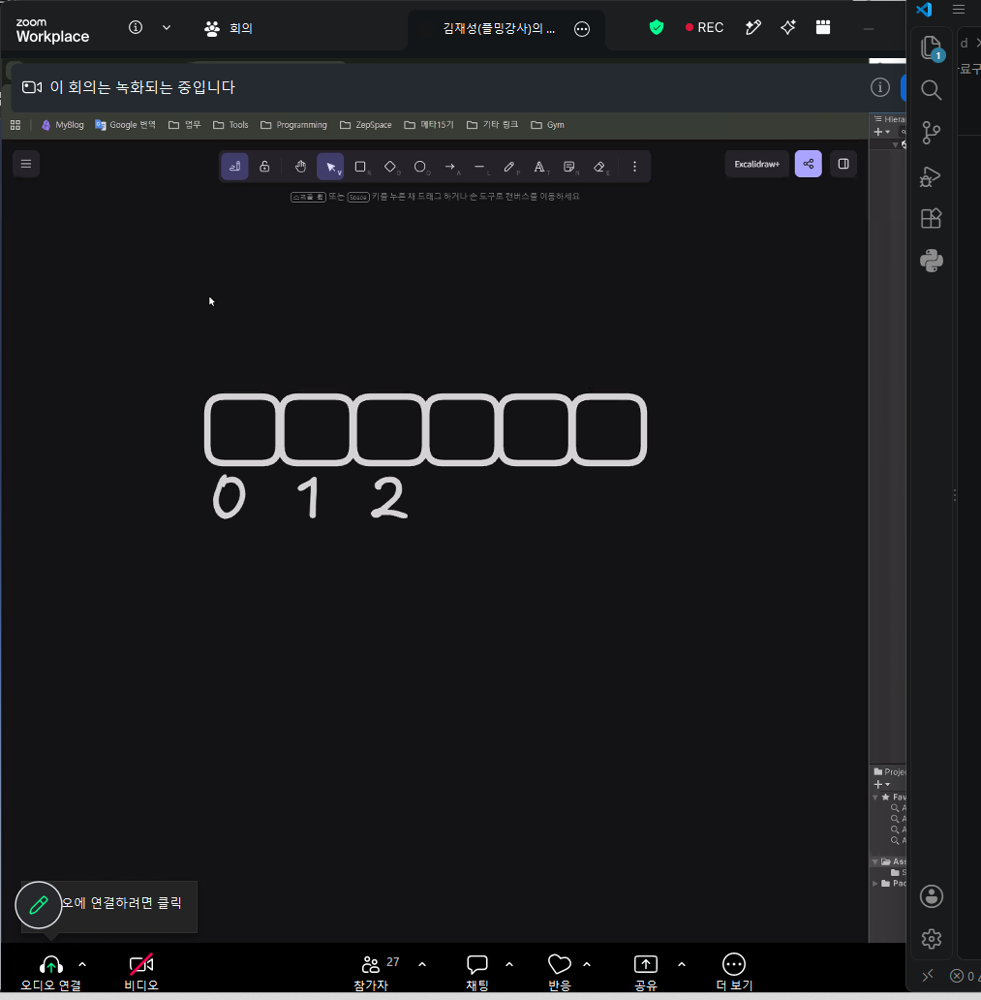
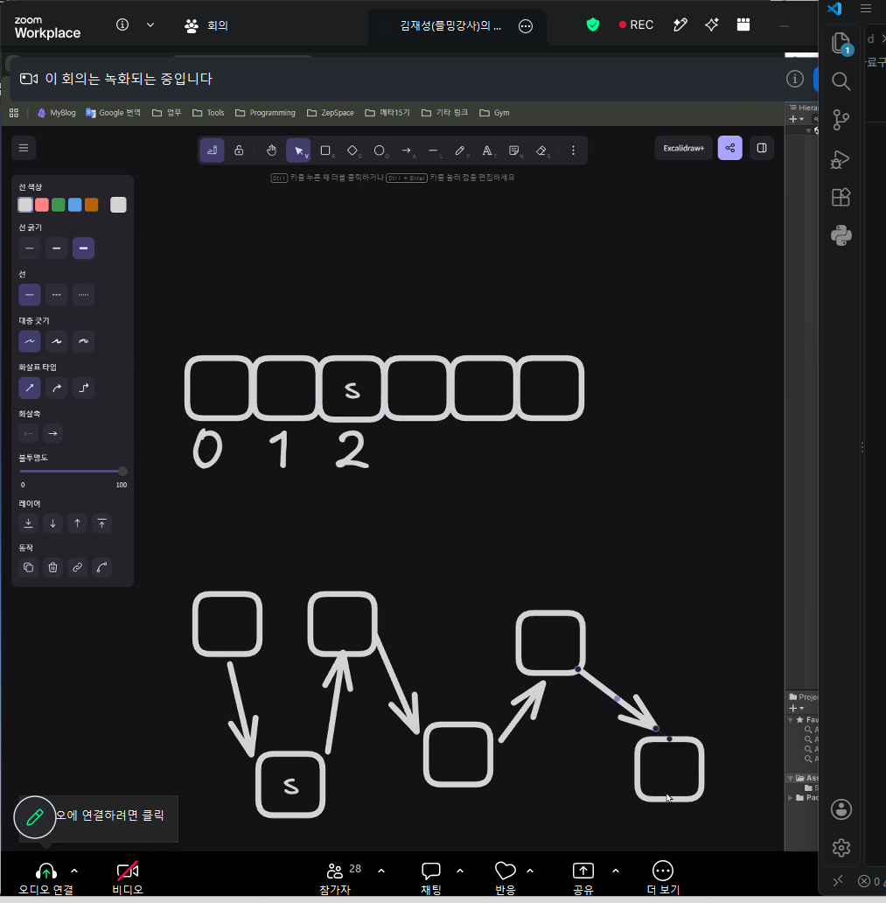
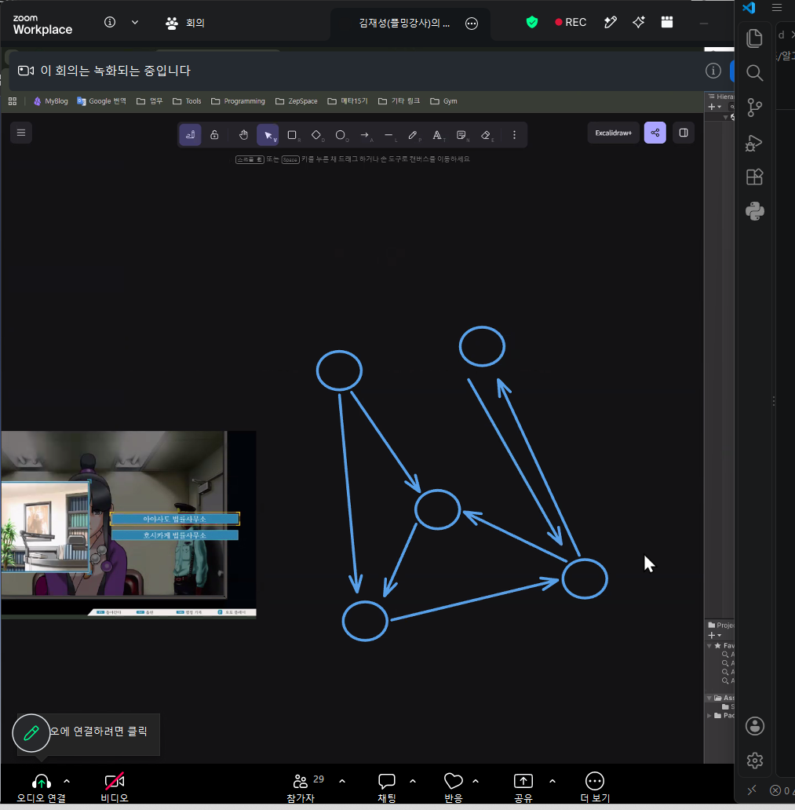
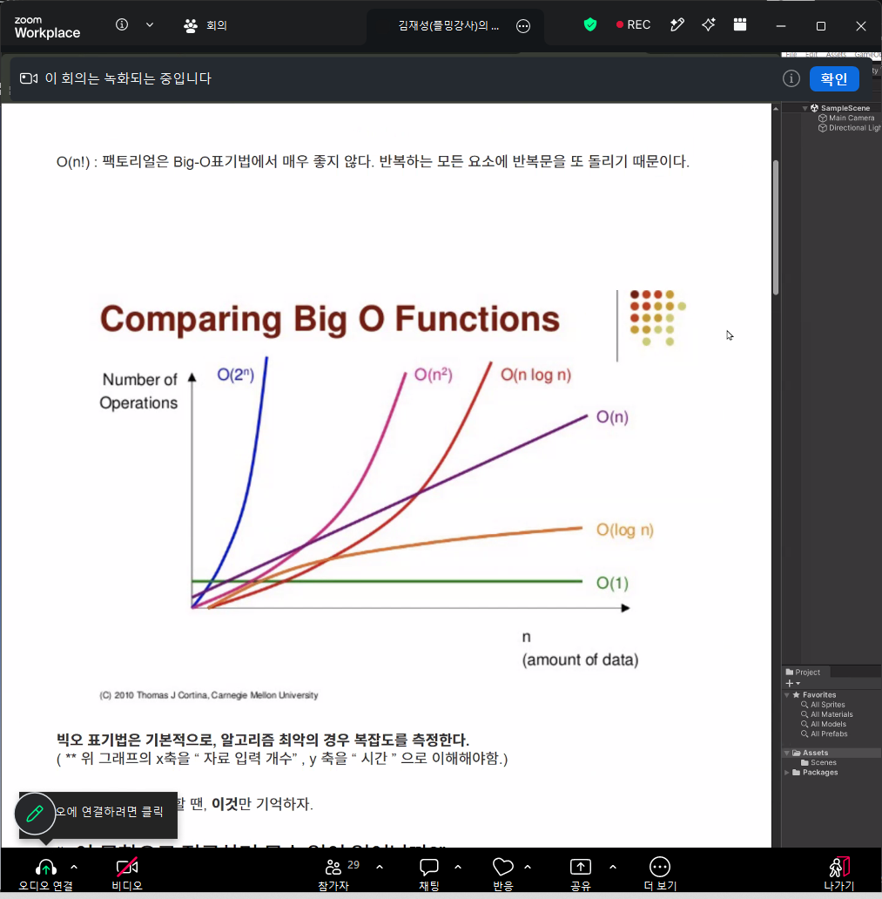
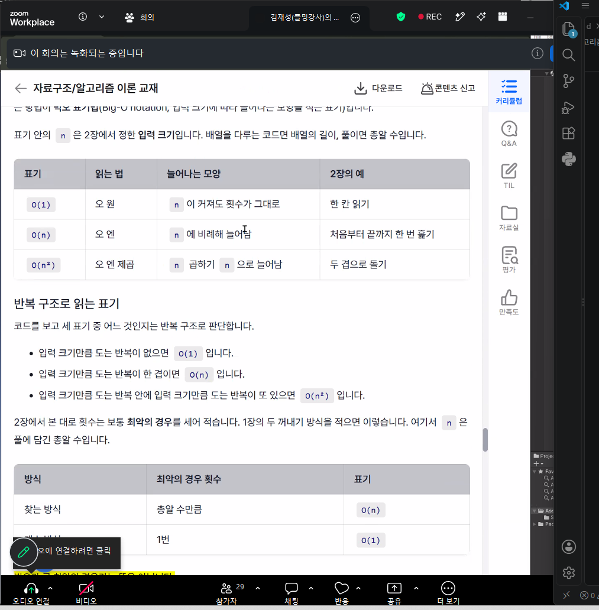

# 260921 알고리즘(1) 자료구조/알고리즘 이론
## 1. 자료구조/알고리즘
### 1.1. 개요
- 힘든 이유가 단순 문제 해결 절차가 굳어진 경우가 있기 때문이다. 
- 로그라이크의 경우 어떤 방법을 써서 결과를 내느냐가 있는데 절차 자체를 이름화한 BSP 알고리즘이 있다. 
- A*, JPS도 길찾기 알고리즘인데 방법에 대해 이름이 붙은 케이스이다.
- 많은 개발자들이 이용하는 알고리즘은 알 필요가 있고 그렇다보니 익힐 것들이 많다. 
- 이젠 문법의 싸움이 아닌 개념의 싸움이 된 셈. 
- 최소한의 자료구조만 써도 결과는 나오지만 알고리즘을 심도있게 다루면 소스 코드에서 성능과 효율을 따지게 된다.
- 예전에는 이중 반복문 등을 쓰고 하나하나 다 순회하며 찾던 것들이 한번에 튀어나오도록 효율 자체를 일정 부분 조율 가능하다. 
- 기본 문법에서는 딱히 설명이 없을 것이다. 
- 자료구조들을 많이 알고 있다면 효율적으로 코드를 상황에 따라 짤 수 있을 것.

### 1.2. Linked List
- 예를 들어 알고 있는 것 중에선 배열과 List가 있다.
 

- 이것은 번호가지고 접근을 했었다. 
- 3번째 칸에 슬라임이 있었는데 만일 슬라임을 정확히 뽑아내고 싶으면 몇번째 칸에 있는지만 알면 되었었다. 
- 이 배열의 경우는 데이터 접근이 0에 수렴했다. 
- 단, 어디인지 모른다면 하나하나 뒤져야 했었다. 
- 그래서 한 칸 한 칸 찾으려면 for문을 통해 비교했어야 했다.
- 생각을 달리 해서 일렬로 나열된 경우에서 이전과 나 다음 순서가 적힌 사람 쪽지를 나눴다고 생각했을 때 연속 공간에서 알 순 없었다. 
- 이전, 내 존재, 다음이 적힌 것도 자료구조이다. 
- 배열은 순차 자료구조이고 선형 자료구조이다. 

- 다 따로 앉았었지만 이것도 여전히 선형 자료구조이다. 
- 위에는 List나 배열이었고 지금 말한 밑의 형태는 Linked List라고 표현한다. 
- 어떻게 정리하고 쓰느냐에 따라 달라질 수 있다. 
- 배열에서는 data를 추가하고 싶다면 칸을 밀어서 옮겨줘야 한다. 
- 그런데 이 공간이 1,000개거나 꺼내야 하는 경우에도 for문으로 하는 것은 한계가 있다. 
- 그런데 아까 예시로 든 종이를 통해 다음 사람 적힌 것과 이전 사람 적힌 것을 지우고 이어주기만 하면 된다. 
- 딱히 뒤의 것을 밀거나 할 것이 없다는 셈. 
- 데이터 추가 삭제 과정에서는 위 방식보단 그러한 연산이 개념적으로 사라진다. 
- 이 Linked List의 크기가 1000이라고 한다면 한 번에 끝난다. 
- 이것을 다르게 생각해보자. 이 순서가 Linked List가 모호하다. 첫번째부터 알아야 한다는 것. 
- 이렇게 되면 또 얼마나 돌지 모른다. 
- 인벤토리에서 자료구조가 자주 사용되는데 크기가 엄청 크진 않고 명확한 상황에서 Linked List는 부적절 할 수 있다는 이야기.
- Linked List는 아래 그림처럼 이전 노드와 이후 노드가 연결이 여러개가 되어 성장 방식을 선택할 수 있는 게임이거나 특정 선택 분기에 따라 맵 이동을 할 수 있는 것이 어디인지는 유리하다. 

- 현재 이러한 것은 비선형 자료구조이다. 그래프라는 방식. 
- 데이터를 어떻게 배치하느냐에 따라 구현하는 것이 많고 로직을 효율적으로 굴릴 수 있다.
- 맵을 그래프 형태로 배치하면 특정 맵 이동이라던가 순회를 많이 하는 케이스거나 index가 선택 기준이 될 수 있느냐.
- **자료 구조는 어떻게 정리하는 것인가에 대한 이론적으로 정리된 방법론인 셈.**
- **알고리즘은 담긴 데이터로 일을 처리하는 방식이다.**

## 1.3. 시간 복잡도
- 효율을 따지는 단위 중 하나.
- 체계적으로 표현하는 표준 방식.
- 로직의 성능을 말하는 표준 표기법.
- 예를 들어 자를 통해서 크기를 측정할 수 있는 이유는 단위가 정해졌기 때문이다. 
- 단위를 정해놓고 측정가능해야 하는데 이 로직에 대한 성능을 측정하는 단위 중 하나가 시간 복잡도인 것이고 표기 방식은 big-O 표기법이라고 한다. 
- 프로그램이 빨리 돌아간다는 성능이란 것은 연산량이 얼마나 되는지가 기준이 된다. 

- O1은 한 번에 끝난다는 의미이다. 배열이 좋은 예시.
- O(n)은 개수만큼 순회를 돌아야 할 때는 직선 그래프
- O(log n)의 경우는 여러번 수행해야 할 경우 해당한다. 연산 속도가 많으면 많을수록 유리.
- O(2^n)의 경우, 업데이트에서 10만번 반복했을 때 프레임 드랍이 일어났던 현상과 유사한 느낌이다. 
- 신입 개발자 면접에서는 이것을 왜 썼는지에 대한 질문이 자주 들어온다. 그러므로 자료구조를 이해하고 있어야 한다. 
- 그래서 시간 복잡도의 표기는 

- 한 번에 들어간다, 순회 등인데 로직 중에 짧게라도 생각하면 이 시간복잡도 어디에 해당하는지 생각해봐야 한다. 
- 소스 코드를 적는 과정에서 이것을 생각하면 좋겠지만 일단은 짜고 나서 생각해볼 것을 권장한다. 
- 효율을 생각하며 짜는 것은 엄청 오랫동안 걸리는 행위고 시간 낭비가 될 수 있다. 
- 일단은 결과물 나와놓고 개선이 되어야 한다. 따라서 이런 이론에 잡아먹히면 안된다. 
- 